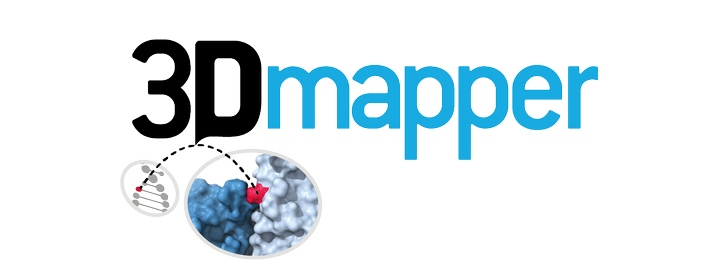

[](
 https://travis-ci.com/username/vicruiser/3Dmapper)
 [](https://gitter.im/pdbmapper/community?utm_source=badge&utm_medium=badge&utm_campaign=pr-badge&utm_content=badge)

<p align="center">

</p>

# Overview

3Dmapper is a Python and R tool to map annotated genomic variants or positions to protein structures.
 <p align="center">

</p>

# Install 

```bash
git clone https://github.com/vicruiser/3Dmapper.git
cd 3Dmapper
pip install . 
```

# Generation of local interfaces database

## Requirements 
 - Your own structural database. 3Dmapper only accepts coordinate files (either real structures or models) in *PDB or CIF format*. To avoid redundancy, we recommend to use biological assemblies of the structures. 
 - BLAST standalone software. Follow this [instructions](https://blast.ncbi.nlm.nih.gov/Blast.cgi?CMD=Web&PAGE_TYPE=BlastDocs&DOC_TYPE=Download) to download and use the command line tool.
 - A target proteome. This is easly done running the command "makeblastdb" from BLAST with the set of protein sequences of your choice.
```markdown
makeblastdb -in target_proteome.fasta -db_type protein -out proteins_db
``` 
## Overview

Per each PDB file downloaded, run makeinterfacedb will do the following:  
  1) Extract their protein chains. 
  2) BLAST against the proteome of interest 
  3) Predict interfaces
  4) Map sequence and PDB positions. 

## Example
```markdown
makeinterfacedb -pdb file.pdb --blast-db proteins_db  -b
```

## Results
The output interfaces database is a XXXX column tab-delimited containing the following

| Column name               | Notes                                                                                                                                          |
| :------------------------ | :--------------------------------------------------------------------------------------------------------------------------------------------- |
| **PDB_code**              | Biological Assembly PDB ID                                                                                                                     |
| **Protein_accession**     | Ensembl protein ID                                                                                                                             |
| **PDB_chain**             | Template chain (only protein)                                                                                                                  |
| **PDB_interacting_chain** | Interacting chain (protein, ligand or DNA)                                                                                                     |
| **Protein_length**        | Length of the Ensembl protein sequence (without including the gaps of the alignment)                                                           |
| **Protein_start_pos**     | Start of alignment in the Ensembl protein sequence (template chain)                                                                            |
| **Protein_end_pos**       | End of alignment in the Ensembl protein sequence (template chain)                                                                              |
| **Length_align**          | Length of the alignment between Ensembl protein sequence (subject) and PDB chain sequence (query)                                              |
| **Pident**                | Sequence Identity percent. This parameter serves as threshold. Only results with pident equal or higher to 50% are included                    |
| **Interaction**           | Type of interfacial interaction, i.e., “protein”,”nucleic” or “ligand”                                                                         |
| **PDB_aa**                | residues of aligned query (PDB chain) sequence (i.e.: only aligned and includes gaps.)                                                         |
| **Protein_aa**            | residues of aligned subject (Ensembl) sequence (i.e.: only aligned and includes gaps.)                                                         |
| **PDB_pos**               | index position of each residue of the aligned query (PDB chain) sequence starting from 1                                                       |
| **Protein_pos**           | index position of each residue of the aligned subject (Ensembl) sequence starting from 1                                                       |
| **PDB_align_pos**         | real index position of each residue of the aligned query (PDB chain) sequence                                                                  |
| **Protein_align_pos**     | Position of the interfacial residues on the Ensembl protein sequence. This is the column of your interest! (Protein position in the MC3 file). |
| **PDB_pos**               | Corresponding position of the interfacial residues on the PDB chain sequence                                                                   |

# Split variants / position files
```markdown
makevariantsdb -vf variants.vep 
```

# Split interface DB
```markdown
makepsdb -psdb interfaces/interfacesDB.txt -s
```

The default input format is a simple whitespace-separated format (columns may be separated by space or tab characters), containing six required columns. Any extra columns will be included in the results. Empty values are denoted by '-'.

- PROTEIN_ACCESION: Ensembl or Uniprot accesion identifier. 
- TRANSCRIPT_ACCESION: Ensembl identifier. 
- PROTEIN_POSITION: residue position on the protein. 
- PDB_CODE
- PDB_CHAIN
- PROTEIN_FEATURE_ID : structural identifier made up by the user, e.g.: PROTEIN_POSITION + PDB_CODE + PDB_CHAIN

Optional but recommendable for downstream analysis:
- AMINO_ACIDS: original residue. 
- PDB_AMINO_ACIDS: original residue in the PDB file. 
- PIDENT: sequence identity percentage between the protein sequence and the PDB chain. When available, this can be moludated as a filter parameter with the option `--pident`. 

Example

`ENSP0000023123  ENST0000023123  123    1wqs    A   ep300_1wqs_A`

# Map variants
```markdown
mapper -pid ENSP00000356150 -psdb DBs/psdb -vdb DBs/varDB/ -ids dict_geneprot_GRCh38.txt  -f 
```

The input annotated genomic variants file must be either in [VCF](https://en.wikipedia.org/wiki/Variant_Call_Format), [VEP](https://www.ensembl.org/info/docs/tools/vep/vep_formats.html#defaultout) or [MAF] (https://docs.gdc.cancer.gov/Data/File_Formats/MAF_Format/) default format. Additionally, a VEP-like format is admisible. This is in question same as VEP but not all the files are needed: 

- Uploaded_variation
- Gene
- Feature
- Consequence
- Protein_position
- Amino_acids (optional but recommedable)


# 3D visualization with ChimeraX

Results can be visualized running

```markdown
makechimera xxxx
```

# Dependencies
- samtools

# Paralellization

3Dmapper can be parallelized parallelization. While `makepsdb` and `makevariantsdb` run with GNU parallel [ref], `mapper` uses the python module joblib. 

An alternative to parallelaize 3Dmapper is to is to give as input the protein ids in individual tasks to perform a job array in a cluster computer?. The first task should write the initial files. The rest set the option `-force n` to prevent repeating innecesary steps. 
