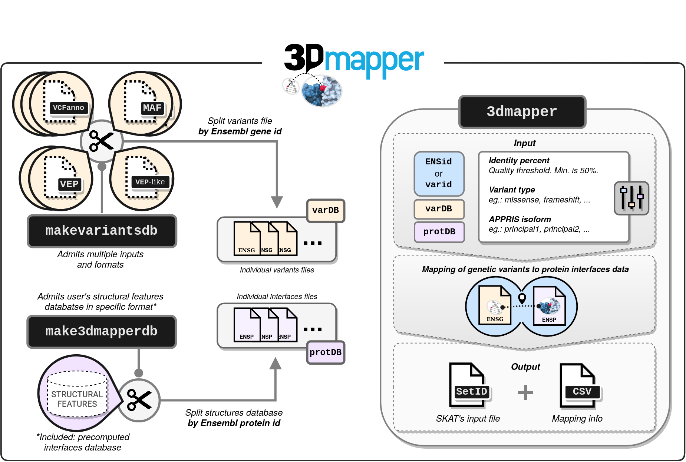

[](https://travis-ci.com/username/vicruiser/3Dmapper) [](https://gitter.im/pdbmapper/community?utm_source=badge&utm_medium=badge&utm_campaign=pr-badge&utm_content=badge)

# Overview

3Dmapper is a Python and R tool to map annotated genomic variants or positions to protein structures.

<p align="center">



</p>

# Install

``` bash
git clone https://github.com/vicruiser/3Dmapper.git
cd 3Dmapper
pip install . 
```

# Generation of local interfaces database

## Requirements

-   A set of *PDB or CIF* files of interest (either real structures or models).\
-   BLAST standalone software. Follow these [instructions](https://blast.ncbi.nlm.nih.gov/Blast.cgi?CMD=Web&PAGE_TYPE=BlastDocs&DOC_TYPE=Download) to download and use the command line tool.
-   A target proteome built running the BLAST command `makeblastdb` with the set of protein sequences of interest.
-   R version > 3.0.0

## Overview

For each of the PDB files we are going to consider, `makeinterfacedb` automatically will do the following:\
1) Extract its PDB chain sequences. 2) BLAST PDB chain sequences against the proteome of interest. 3) Predict interfaces of hits passing the selected homology filtering. 4) Merge PDB and proteome data.

## Example

If we were interested in mapping variants or positions to the protein structures of human, we have to download the human proteome from [UniProt](https://ftp.uniprot.org/pub/databases/uniprot/current_release/knowledgebase/reference_proteomes/Eukaryota/UP000005640/UP000005640_9606.fasta.gz) or [Ensembl](http://ftp.ensembl.org/pub/release-104/fasta/homo_sapiens/pep/Homo_sapiens.GRCh38.pep.all.fa.gz) for example. With this set of protein sequences in fasta format, we build the target proteome database for the BLAST search executing the following command:

``` markdown
makeblastdb -in target_proteome.fasta -dbtype prot -out target_proteome_db
```

This command will generate three files with name "target_proteome_db" and extensions `.phr`, `.pin` and `.psq`.

Next, we download the PDB files of interest. If you would like to retrieve interfaces and or structures of proteins that currently do not have structure, relying on sequence homology, we suggest to download all the files in PDB.

Finally, we build the structural database executing one of the following commands: 1) Input the PDB files as a list of PDB files.

``` markdown
makeinterfacedb -pdb list_pdbs.txt --blast_db target_proteome_db
```

2)  Input all the PDBs in the same input argument:

``` markdown
makeinterfacedb -pdb pdb_dir/* --blast_db target_proteome_db
```

3)  Run `makeinterfacedb` in separate tasks per PDB file. This setting is useful when running jobs in parallel using job arrays or greasy as the results will be written in the same output file.

``` markdown
makeinterfacedb -pdb file1.pdb --blast_db target_proteome_db
makeinterfacedb -pdb file2.pdb --blast_db target_proteome_db
makeinterfacedb -pdb file3.pdb --blast_db target_proteome_db
...
makeinterfacedb -pdb fileN.pdb --blast_db target_proteome_db
```

Note: it is recommendable to add the option `-b` to remove crystallographic artifacts (based on the [BioLiP artifact ligand list](https://zhanggroup.org/BioLiP/ligand_list)) which can be mistaken by real ligands.

## Output interfaceDB.txt

The output interfaces database is a 22 column tab-delimited file. In all cases, **"PDB chain"** refers to the extracted PDB chain or query sequence from each PDB file and **"Protein"** refers to the hit sequence found with the Blast search against the target proteome. A more detailed description of the meaning of each column ID is specified in the table below.

| Column name                              | Notes               |
|-----------------------------------------:|-----------------------------------------------------------------------------------------------------------------------------------------------------:|
| **Protein_accession** **Protein_length** | Target protein ID Length of the target protein sequence                                                                                             |
| **Protein_position**                     | Positions relative to the target protein sequence                                                                                                   |

| **Protein_aa**                           | Amino acids corresponding to the target protein positions                                                                                           |

| **PDB_code**                             | PDB ID                                                                                                                                              |

| **PDB_chain**                            | ID of the template PDB protein chain                                                                                                                |

| **PDB_chain_length**                     | Length of the PDB chain sequence                                                                                                                    |

| **PDB_3D_position**                      | Position in the PDB chain **structure**                                                                                                             |

| **PDB_seq_position**                     | Position in the PDB chain **sequence**                                                                                                              |

| **PDB_aa**                               | Amino acids corresponding to both the PDB sequence and 3D positions                                                                                 |

| **Evalue**                               | E-value of the alignment between the query or PDB chain sequence and the target protein                                                             |

| **Pident**                               | Identity percent between the query (PDB chain) and the target sequence (protein).                                                                   |

| **Protein_coverage**                     | Coverage (%) of the target protein by the PDB chain sequence                                                                                        |

| **Length_alignment**                     | Total length of the alignment between the query or PDB chain sequence and the target protein                                                        |

| **Interaction_type**                     | Type of interface interaction: "protein","nucleic" or "ligand". NA means no interaction which represents the positions of the rest of the structure |

| **PDB_interacting_chain**                | Interacting PDB chain ID with the template PDB chain. NA means no interaction which represents the positions of the rest of the structure           |

| **PDB_interacting_3D_position**          | Position in the interacting PDB chain **structure**                                                                                                 |

| **PDB_interacting_aa**                   | Amino acids corresponding to the interacting PDB structure positions                                                                                |

| **Interface_min_distance**               | Minimum existing distance between the pair of selected positions participating in the interface                                                     |

| **PDB_B\_factor**                        | Minimum B factor (or pLDDT in the case of AF2 models) observed in each PDB 3D position                                                              |

| **PDB_interacting_B\_factor**            | Minimum B factor (or pLDDT in the case of AF2 models) observed in each PDB interacting 3D position                                                  |

| **Protein_alignment_start**              | Alignment start position in target protein sequence                                                                                                 |

| **Protein_alignment_end**                | Alignment end position in target protein sequence                                                                                                   |

| **PDB_alignment_start**                  | Alignment start position in PDB chain protein sequence                                                                                              |

| **PDB_alignment_end**                    | Alignment end position in PDB chain protein sequence                                                                                                |

| **Structure_feature_id**                 | As `PDB_code`\_`Protein_accession`\_`PDB_chain`\_`PDB_interacting_chain`\_`Interaction_type`                                                        |


# Split structural data DB

To reduce the computational workload during the mapping process, the structural data set generated in the previous step is divided by protein IDs into individual files by executing the following command:

``` markdown
makepsdb -psdb interfaces/interfacesDB.txt
```

The following directories and files are generated:

    |__DBs
         |_____makepsdb.log
         |_____makepsdb.report
         |_____psdb
                |_____prot_ID1.txt
                |_____prot_ID2.txt        
                |_____...        
                |_____prot_IDn.txt        

Files makepsdb.log and makepsdb.report report the progress of the executed command and then folder psdb contains allthe splitted files.

# Split variants / annotated positions files

Like in the previous step, we repeat the splitting file process, but this time, using the variants or annotated positions files.

## Input files format

The input annotated genomic variants file must be either in [VCF](https://en.wikipedia.org/wiki/Variant_Call_Format), [VEP](https://www.ensembl.org/info/docs/tools/vep/vep_formats.html#defaultout) or [MAF](https://docs.gdc.cancer.gov/Data/File_Formats/MAF_Format/) default format. Additionally, a VEP-like format is admissible. This is in question same as VEP but not all the files are needed:

-   Uploaded_variation
-   Gene
-   Feature
-   Consequence
-   Protein_position
-   Amino_acids

## Example

``` markdown
makevariantsdb -vf variants.vep 
```

# Map variants

``` markdown
mapper -pid ENSP00000356150 -psdb DBs/psdb -vdb DBs/varDB/ -ids dict_geneprot_GRCh38.txt  -f 
```

# 3D visualization with ChimeraX

Results can be visualized running

``` markdown
makechimera xxxx
```

# Dependencies

-   samtools

# Paralellization

3Dmapper can be parallelized parallelization. While `makepsdb` and `makevariantsdb` run with GNU parallel \[ref\], `mapper` uses the python module joblib.

An alternative to parallelaize 3Dmapper is to is to give as input the protein ids in individual tasks to perform a job array in a cluster computer?. The first task should write the initial files. The rest set the option `-force n` to prevent repeating innecesary steps.
