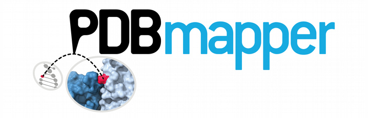

# Introduction

## Motivation
PDB mapper is a tool to map annotated genomic variants to protein interfaces data in 3D.

## Overview
The PDBmaper program supports xxx different search methods:

# Usage

## Running PDBmapper

```markdown
python3 pdbmapper -protid ENSP00000482258 -vcf file.vcf 
```
### Test

<!-- More details in ./test -->

## Reference

| <!--    | Setup                   | Command | Notes |
| :------ | :---------------------- | :------ |
| install | `pip install pdbmapper` | -->     |
<!-- 
| <!--   | Creating a CLI         | Command                                   | Notes |
| :----- | :--------------------- | :---------------------------------------- |
| import | `import fire`          |
| Call   | `fire.Fire()`          | Turns the current module into a Fire CLI. |
| Call   | `fire.Fire(component)` | Turns `component` into a Fire CLI. -->    |
<!-- 
| <!-- Using a CLI                                | Command                                 | Notes                                                    |
| :---------------------------------------------- | :-------------------------------------- | :------------------------------------------------------- |
| [Help](docs/using-cli.md#help-flag)             | `command --help` or `command -- --help` |
| [REPL](docs/using-cli.md#interactive-flag)      | `command -- --protid`                   | Protein id ensembl.                                      |
| [Separator](docs/using-cli.md#separator-flag)   | `command -- --separator=X`              | Sets the separator to `X`. The default separator is `-`. |
| [Completion](docs/using-cli.md#completion-flag) | `command -- --completion [shell]`       | Generates a completion script for the CLI.               |
| [Trace](docs/using-cli.md#trace-flag)           | `command -- --trace`                    | Gets a Fire trace for the command.                       |
| [Verbose](docs/using-cli.md#verbose-flag)       | `command -- --verbose`                  | -->                                                      | --> --> |

### Paralellization

PDBmapper is not possible to run in parallel per se. However, the easiest way to do this is to give as input the protein ids individually in parallel tasks. The first task should write the initial files. The rest set the option `-force n` to prevent repeating innecesary steps. 

**Explain better or implemen a parallel option** 

# PDBmapper databases

## Interfaces database

An already pre-computed database with a total number of **the number** proteins. Since an interface database is not an standard thing to  have, PDBmapper has been designed to manage databases of interfaces that are in a certain format. The default format is a 10 column tab-delimited file. Empty values are denoted by '-'. The output columns are: 

| Column name         | Notes                                                                                                                                                                 |
| :------------------ | :-------------------------------------------------------------------------------------------------------------------------------------------------------------------- |
| **pdb.id**          | Biological Assembly pdb id                                                                                                                                            |
| **ensembl.prot.id** | Ensembl protein ID                                                                                                                                                    |
| **temp.chain**      | Template chain (only protein)                                                                                                                                         |
| **int.chain**       | Interacting chain (protein, ligand or DNA)                                                                                                                            |
| **temp.length**     | Length of the Ensembl protein sequence (without including the gaps of the alignment)                                                                                  |
| **temp.start**      | Start of alignment in the Ensembl protein sequence (template chain)                                                                                                   |
| **temp.end**        | End of alignment in the Ensembl protein sequence (template chain)                                                                                                     |
| **length.ali**      | Length of the alignment between Ensembl protein sequence (subject) and PDB chain sequence (query)                                                                     |
| **pident**          | Sequence Identity percent. This parameter serves as threshold. Only results with pident equal or higher to 50% are included                                           |
| **interaction**     | Type of interfacial interaction, i.e., “protein”,”nucleic” or “ligand”                                                                                                |
| **resid_qseq**      | residues of aligned query (PDB chain) sequence (i.e.: only aligned and includes gaps.)                                                                                |
| **resid_sseq**      | residues of aligned subject (Ensembl) sequence (i.e.: only aligned and includes gaps.)                                                                                |
| **qpos**            | index position of each residue of the aligned query (PDB chain) sequence starting from 1                                                                              |
| **spos**            | index position of each residue of the aligned subject (Ensembl) sequence starting from 1                                                                              |
| **q_ali_pos**       | real index position of each residue of the aligned query (PDB chain) sequence (i.e, + qstart)                                                                         |
| **mapped.real.pos** | Position of the interfacial residues on the Ensembl protein sequence. At the end of the day, this is the column of your interest! (Protein position in the MC3 file). |
| **pdb.pos**         | Corresponding position of the interfacial residues on the PDB chain sequence                                                                                          |

## Variant annotated files

The input annotated genomic variants file must be either in [VCF](https://en.wikipedia.org/wiki/Variant_Call_Format) or [VEP](https://www.ensembl.org/info/docs/tools/vep/vep_formats.html#defaultout) default format. 

### ClinVar

## Custom

Para poner tus propias databases han de cumplir con los siguientes requisitos de formato. 


# 3D visualization with ChimeraX

soon available

# FAQs

is not intended as a interface generator. 


You can use the [editor on GitHub](https://github.com/vicruiser/PDBmapper/edit/master/README.md) to maintain and preview the content for your website in Markdown files.

Whenever you commit to this repository, GitHub Pages will run [Jekyll](https://jekyllrb.com/) to rebuild the pages in your site, from the content in your Markdown files.

### Markdown

Markdown is a lightweight and easy-to-use syntax for styling your writing. It includes conventions for

```markdown
Syntax highlighted code block

# Header 1
## Header 2
### Header 3

- Bulleted
- List

1. Numbered
2. List

**Bold** and _Italic_ and `Code` text

[Link](url) and 
```

For more details see [GitHub Flavored Markdown](https://guides.github.com/features/mastering-markdown/).

### Jekyll Themes

Your Pages site will use the layout and styles from the Jekyll theme you have selected in your [repository settings](https://github.com/vicruiser/PDBmapper/settings). The name of this theme is saved in the Jekyll `_config.yml` configuration file.

### Support or Contact

Having trouble with Pages? Check out our [documentation](https://help.github.com/categories/github-pages-basics/) or [contact support](https://github.com/contact) and we’ll help you sort it out.

