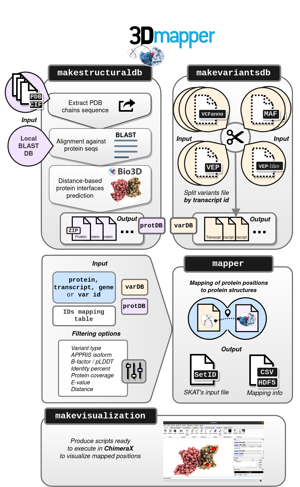

[](https://travis-ci.com/username/vicruiser/3Dmapper) [](https://gitter.im/pdbmapper/community?utm_source=badge&utm_medium=badge&utm_campaign=pr-badge&utm_content=badge)

# Overview

3Dmapper is a command line tool based on R and Python programming languages that maps annotated genomic variants or positions to protein structures.

<p align="center">



</p>

# Dependencies

## Installed by user

-   BLAST standalone software version >= 2.6. Follow these [instructions](https://blast.ncbi.nlm.nih.gov/Blast.cgi?CMD=Web&PAGE_TYPE=BlastDocs&DOC_TYPE=Download) to download and use the command line tool.
-   Python > 3.6
-   R version > 3.5
-   [GNU parallel](https://www.gnu.org/software/parallel/)

## Automatically installed

-   BCFtools 1.13

-   HTSlib 1.13

-   R packages:

    -   seqinr 4.2-4
    -   reshape2 1.4.4
    -   data.table 1.13.6
    -   dplyr 1.0.4
    -   plyr 1.8.6
    -   bio3d 2.4-2
    -   stringr 1.4.0
    -   tidyr 1.1.2
    -   veriNA3d 1.0.3

# Install

In a Linux OS open a terminal and enter the following:

``` bash
git clone https://github.com/vicruiser/3Dmapper.git
cd 3Dmapper
pip install . 
```

# Index of tools

  - [`makeinterfacedb`](#makeintdb): Create a protein structure database which includes protein-protein, protein-ligand and protein-nucleic interfaces.
``` markdown
makeinterfacedb -pdb pdb_dir/* --blast_db target_proteome_db
```
  - [`makepsdb`](#makepsdb): Split the protein structure database. 
``` markdown
makepsdb -psdb makeinterfacedb_output.txt -s
```
  - [`makevariantsdb`](#makevardb): Split a variants file or positions file. 
``` markdown
makevariantsdb -vf variants.vep 
```
  - [`mapper`](#mapper): Map variants or protein positions to the structure of proteins, including their interfaces. 
``` markdown
mapper -pid ENSP00000356150 -psdb DBs/psdb -vdb DBs/varDB/ -ids dict_geneprot_GRCh38.txt  -csv
```
  - [`makechimera`](#makechim): Generate [ChimeraX](https://www.rbvi.ucsf.edu/chimerax/) scripts to visualize the mapping results. 
``` markdown
makechimera 
```

The complete list of input arguments for each of the commands is available when typing `-h`. 

# Tutorial

## <a name="makeintdb"></a> 1. Generation of a local protein structures database with `makeinterfacedb`

For each of the considered PDB files, `makeinterfacedb` automatically will: 
1) Extract the PDB chain sequences. 
2) BLAST PDB chain sequences (query) against the target proteome of interest (subject). 
3) Retrieve structural data of hits passing the selected homology filtering.

### Input files

-   A set of *PDB or CIF* files of interest (either real structures or models).
-   A target proteome BLAST database. More details on how to do this can be found in the example below.

### Example

In this example, we are going to **0generate a structural database of human proteins**.

1)  Retrieve the human proteome in FASTA format. This can be done using a public repository such as [UniProt](https://ftp.uniprot.org/pub/databases/uniprot/current_release/knowledgebase/reference_proteomes/Eukaryota/UP000005640/UP000005640_9606.fasta.gz) or [Ensembl](http://ftp.ensembl.org/pub/release-104/fasta/homo_sapiens/pep/Homo_sapiens.GRCh38.pep.all.fa.gz).

2)  Build a BLAST protein database for the BLAST search: 

``` markdown
makeblastdb -in target_proteome.fasta -dbtype prot -out target_proteome_db
```
This command will generate three files with name "target_proteome_db" and extensions `.phr`, `.pin` and `.psq`.

3)  Download a set of PDB files of interest. If you would like to retrieve structural data for proteins that currently do not have structure in PDB, you can download all the files in PDB and rely on sequence homology to find structural homologs.

4)  Build the structural database. You can input the PDB data in three different ways:

  - As a list of files directly specified in the command line:
``` markdown
makeinterfacedb -pdb pdb_dir/* --blast_db target_proteome_db
```
-   As a plain text file (.txt) with one PDB file path per line: 
``` markdown
makeinterfacedb -pdb list_pdbs.txt --blast_db target_proteome_db
``` 
Note: Crystallographic artifacts can be removed with the option `-b`, based on the [BioLiP artifact ligand list](https://zhanggroup.org/BioLiP/ligand_list).

### Output

The output is a 22 column tab-delimited file. In all cases, **"PDB chain"** refers to the extracted PDB chain or query sequence from each PDB file and **"Protein"** refers to the hit sequence found with the BLAST search against the target proteome. A more detailed description of the meaning of each column ID is specified in the table below.


| Column name                              | Notes                                                                                                                                           |
|:-----------------------------------------|:--------------------------------------------------------------------------------------------------------------------|
| **Protein_accession**  | Target protein ID Length of the target protein sequence   |
| **Protein_length**     | Length of protein sequence  |
| **Protein_position**                     | Positions relative to the target protein sequence  |
| **Protein_aa**                           | Amino acids corresponding to the target protein positions                                                                                           |
| **PDB_code**                             | PDB ID                                                                                                                                              |
| **PDB_chain**                            | ID of the template PDB protein chain                                                                                                                |
| **PDB_chain_length**                     | Length of PDB chain sequence                                                                                                                    |
| **PDB_3D_position**                      | Position in the PDB chain **structure**                                                                                                           |
| **PDB_seq_position**                     | Position in the PDB chain **sequence**                                                                                                              |
| **PDB_aa**                               | Amino acids corresponding to both the PDB sequence and 3D positions                                                                                 |
| **Evalue**                               | E-value of the alignment between the query or PDB chain sequence and the target protein                                                             |
| **Pident**                               | Identity percent between the query (PDB chain) and the target sequence (protein).                                                                   |
| **Protein_coverage**                     | Coverage (%) of the target protein by the PDB chain sequence                                                                                        |
| **Length_alignment**                     | Total length of the alignment between the query or PDB chain sequence and the target protein                                                        |
| **Interaction_type**                     | Type of interface interaction: "protein","nucleic" or "ligand". NA means no interaction which represents the positions of the rest of the structure |
| **PDB_interacting_chain**                | Interacting PDB chain ID with the template PDB chain. NA means no interaction which represents the positions of the rest of the structure           |
| **PDB_interacting_3D_position**          | Position in the interacting PDB chain **structure**                                                                                                 |
| **PDB_interacting_aa**                   | Amino acids corresponding to the interacting PDB structure positions                                                                                |
| **Interface_min_distance**               | Minimum existing distance between the pair of selected positions participating in the interface                                                     |
| **PDB_B\_factor**                        | Minimum B factor (or pLDDT in the case of AF2 models) observed in each PDB 3D position                                                              |
| **PDB_interacting_B\_factor**            | Minimum B factor (or pLDDT in the case of AF2 models) observed in each PDB interacting 3D position                                                  |
| **Protein_alignment_start**              | Alignment start position in target protein sequence                                                                                                 |
| **Protein_alignment_end**                | Alignment end position in target protein sequence                                                                                                   |
| **PDB_alignment_start**                  | Alignment start position in PDB chain protein sequence                                                                                              |
| **PDB_alignment_end**                    | Alignment end position in PDB chain protein sequence                                                                                                |
| **Structure_feature_id**                 | As `PDB_code`\_`Protein_accession`\_`PDB_chain`\_`PDB_interacting_chain`\_`Interaction_type`                                                        |

## <a name="makepsdb"></a>  2. Split structural data DB with `makepsdb`

To reduce the computational workload during the mapping process, the structural data set generated in the previous step is divided, by protein IDs, into individual files by executing the following command:

``` markdown
makepsdb -psdb makeinterfacedb_output.txt -s
```
The option `-s` indicates that the makeinterfacedb_output.txt will be sorted, which accelerates the splitting process when the structural database is big. 

### Output
The following directories and files are generated:

    |__DBs
         |_____makepsdb.log
         |_____makepsdb.report
         |_____psdb
                |_____prot_ID1.txt
                |_____prot_ID2.txt        
                |_____...        
                |_____prot_IDn.txt        

By default, a directory called *DBs* is created containing files *makepsdb.log* and *makepsdb.report*, which inform about the the executed command and the *psdb* directory which contains the splitted files.

## <a name="makevardb"></a>  3. Split variants / annotated positions files with `makevariantsdb`

Similar the previous step,to accelerate the mapping process, we need to split variants or annotated positions files by individual transcript IDs. 

### Input files

#### Variants file

The input annotated genomic variants file must be either in [VCF](https://en.wikipedia.org/wiki/Variant_Call_Format), [VEP](https://www.ensembl.org/info/docs/tools/vep/vep_formats.html#defaultout) or [MAF](https://docs.gdc.cancer.gov/Data/File_Formats/MAF_Format/) default format. Additionally, a VEP-like format is admissible which must contain at least the following columns: 

    Uploaded_variation
    Gene
    Feature
    Consequence
    Protein_position
    Amino_acids

#### Positions file

If we want to *map a set of positions to protein structures that are NOT mutations*, we have to create a "positions" file. Its format imitates the one of variants files. More specifically, the easiest way to generate a "positions file" is to replicate the VEP-like format, keeping the same column names but adding some modifications. 

An example of a position file would be: 

    Uploaded_variation: contains the position ID
    Gene: can be aprotein ID
    Feature: can be a protein ID
    Consequence: description of this position, if any. Examples could be "conserved_position", "functional_position", etc 
    Protein_position: position in the protein sequence
    Amino_acids: corresponding amino acid

This file it is not only useful to map positions or variants to protein structures, but also to find analogous positions of one protein in other protein structures across evolution. For example, if we have identified interesting positions in the spike protein of SARS-CoV-2, we can map this positions not only to the true structure, but also to other protein homologs like the spikes of MERS and SARS-CoV, avoiding the obstacle of manual alignment and mapping. 

### Split files

If the input is an annotated VCF, VEP or VEP-like file we can split it entering the following: 
``` markdown
makevariantsdb -vf variants.vep 
```
If it is a MAF file, then use: 
``` markdown
makevariantsdb -maf variants.maf 
```

### Output
The following directories and files are generated:

    |__DBs
         |_____makevariantsdb.log
         |_____makevariantsdb.report
         |_____varDB
                |_____transcript_ID1.txt
                |_____transcript_ID2.txt        
                |_____...        
                |_____transcript_IDn.txt        

By default, a directory called *DBs* is created containing files *makevariantsdb.log* and *makevaraintsdb.report*, which inform about the the executed command and the *varDB* directory which contains the splitted files by individual transcript ID.

## <a name="mapper"></a>  4. Map variants

Now we are ready to map positions or variants to protein structures. To this extent, as an example, we can execute the following: 

``` markdown
mapper -pid protID  -psdb DBs/psdb -vdb DBs/varDB -ids dict.txt  -csv -l
```

Input arguments: 

- `-pid`: can be a single or a list of protein, transcripts or gene IDs 
- `-ids`: takes a **CSV** file with 3 columns, with **fixed column names** that are **"geneID","transcriptID"** and **"protID"** which contains the conversion between these 3 IDs. More specifically, this conversion file must contain the IDs appearing in the structural dataset and the positions/variants files. In other words, if the structural dataset was generated with a UniProt target proteome, then the protID column would contain UniProt IDs. Additionally, if we use a variants file generated with VEP, then the geneID and transcriptID would correspond to Ensembl IDs. 
- `-csv`: it tells `mapper`to write the results in an output format. `hdf`format is also avaialble. 
- `-l`, `--location`: maps variants or positions and classify them according to their possible location. If this argument is not True, results are reported only in then  which are: 
  - Interface: positions mapping to the computed interfaces
  - Structure: positions mapping to the rest of the structure, i.e.: it does not include interface residues. 
  - Unmapped : positions mapping to the protein sequence but not structure was found for this piece of sequence. 
  - NonCoding: positions that are not in protein coding genes.


To learn about additional arguments, run ``` mapper -h ```.

# <a name="makechimera"></a>  Results visualization with ChimeraX

Results can be visualized running...

``` markdown
makechimera xxxx
```

# Paralellization

## with Joblib
To run `makeinterfacesdb` and `mapper` in parallel, activate the option `-p` or `--parallel` and specify the number of cores you want to use at the same time with `-j` or `--jobs`.

## in a computer cluster
In cluster computing, the option of using parallelization with joblib is not always the optimal approach. Instead, submitting individual tasks is possible as an strategy of parallelization using job arrays or greasy as the results will be appended to the same output file. In 3Dmapper, this option is avaialble for `makeinterfacesdb` and `mapper`. Below you can find two examples on how to run this 

``` markdown
makeinterfacedb -pdb file1.pdb --blast_db target_proteome_db
makeinterfacedb -pdb file2.pdb --blast_db target_proteome_db
makeinterfacedb -pdb file3.pdb --blast_db target_proteome_db
...
makeinterfacedb -pdb fileN.pdb --blast_db target_proteome_db
```

``` markdown
mapper -pid protID1  -psdb DBs/psdb -vdb DBs/varDB -ids dict.txt  -csv -l
mapper -pid protID2  -psdb DBs/psdb -vdb DBs/varDB -ids dict.txt  -csv -l
mapper -pid protID3  -psdb DBs/psdb -vdb DBs/varDB -ids dict.txt  -csv -l
...
mapper -pid protIDN  -psdb DBs/psdb -vdb DBs/varDB -ids dict.txt  -csv -l
```

## with GNU parallel
The splitting process of `makepsdb` and `makevariantsdb` can be greatly improved thanks to GNU parallel \nocite{Tange2011a}. Activate this option with `-p` or `--parallel` and specify the number of cores you want to use at the same time with `-j` or `--jobs`. Manual installation of GNU parallel is required for this step. 
